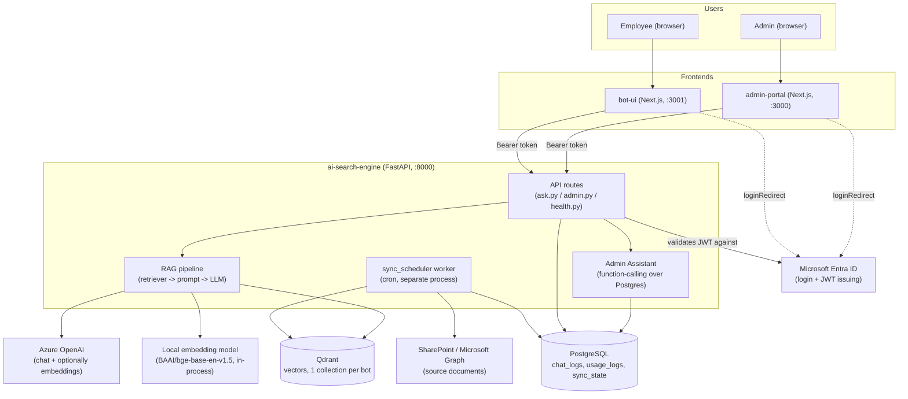

# Master Info — Multi-Bot RAG Search Engine Platform

**Read this file first.** It is the single source of truth for what this
project is, how its three applications fit together, what every important
file does, and what has already been built and fixed. It exists so that any
AI assistant (or human) picking this repo up cold — with zero prior
conversation history — can understand the system deeply enough to extend it,
debug it, or rebuild it from scratch without re-deriving any of this from the
code alone.

The other docs in this folder (`ENGINE_CONCEPT.md`, `API_CONTRACT.md`,
`DESIGN_CONCEPT.md`, `BOT_UI_CONCEPT.md`) are earlier planning documents from
before most of the system was actually built and wired together. Several of
their claims are now stale (e.g. they describe auth and several endpoints as
"not built yet" — they are built, tested, and in production use today). This
file supersedes them as the current, accurate description of the system.

---

## 1. What this project is, in one paragraph

This is a **multi-tenant RAG (Retrieval-Augmented Generation) chatbot
platform**. One FastAPI backend (`ai-search-engine`) hosts any number of
independent chatbots (currently `hr` and `it`), each pulling its knowledge
from its own SharePoint document library, each isolated in its own Qdrant
vector collection, each with its own system prompt and access rules. Two
separate Next.js frontends sit on top of that one backend: an **admin
portal** (`admin-portal`) for configuring bots and watching usage/cost/logs,
and an **end-user chat UI** (`bot-ui`) where employees actually talk to the
bots. Both frontends authenticate real humans via Microsoft Entra ID (Azure
AD) and call the backend with a bearer token; the backend validates that
token and enforces per-bot group-based access control.

Adding a brand-new bot requires **zero code changes** — just one new YAML
file in `ai-search-engine/config/bots/`.

---

## 2. High-level architecture



**Three separate npm/pip projects, three separate processes:**

| App | Tech | Port (dev) | Talks to |
|---|---|---|---|
| `admin-portal` | Next.js 16 (App Router), Tailwind v4, Recharts, MSAL | 3000 | `ai-search-engine` via `/admin/*` and `/ask/*` |
| `bot-ui` | Next.js 16 (App Router), Tailwind v4, MSAL | 3001 | `ai-search-engine` via `/ask/*` and `/bots` |
| `ai-search-engine` | FastAPI, SQLAlchemy, Qdrant client, Azure OpenAI SDK, sentence-transformers | 8000 | Postgres, Qdrant, Azure OpenAI, Microsoft Graph (SharePoint), Entra ID (JWKS) |

In production, Nginx (or equivalent) puts both frontends and the backend
behind one domain, proxying `/api/*` to the backend — that's why the
frontends' `api.ts` files default `API_BASE` to `/api` rather than a full
URL. In local dev, `bot-ui`/`admin-portal` use Next.js's own `rewrites()` in
`next.config.ts` to proxy `/api/*` → `http://localhost:8000/*` instead.

Backend infrastructure runs via Docker Compose
(`ai-search-engine/docker/docker-compose.yml`): `postgres`, `qdrant`, `api`
(the FastAPI app), and `worker` (the same codebase, running only the
SharePoint sync scheduler, as a separate long-lived process/container so a
slow sync job can never block or crash the request-serving API process).

---

## 3. The journey so far (what's been built and fixed)

This section is a condensed history so a future reader understands *why*
the code looks the way it does, not just what it currently does.

**Foundation.** Started as three separate scaffolds: a FastAPI backend with
a working RAG pipeline for one bot, an admin-portal UI built against a mock
API contract (`docs/API_CONTRACT.md`, `docs/DESIGN_CONCEPT.md`), and a
bot-ui chat scaffold (`docs/BOT_UI_CONCEPT.md`). None of the three were
wired to each other yet, and none had real authentication.

**Wiring + auth (the biggest single effort).** Wired both frontends to the
real backend end-to-end, replacing mock data in `api.ts` with real `fetch()`
calls. Implemented full Microsoft Entra ID (Azure AD) sign-in on both
frontends via `@azure/msal-browser` + `@azure/msal-react`, and real JWT
validation on the backend (`app/core/security.py`) against the tenant's
JWKS endpoint — no client secret needed, since it only verifies tokens, it
doesn't issue them. Along the way, fixed a login-loop bug: naively calling
`loginRedirect()` on every 401 raced with MSAL's own redirect handling and
threw `interaction_in_progress`; the fix was a guarded, silent-first token
acquisition flow (`acquireApiToken()` in each frontend's `lib/msal.ts`) plus
an `AuthGate` that blocks rendering until MSAL's own redirect handshake has
fully settled (`Providers.tsx` in both apps).

**Debugging why a bot returned no real answers.** The HR bot was answering
"I don't know" to everything. Root cause was a chain of small SharePoint
integration bugs: the configured library display name didn't exactly match
the real SharePoint library name (so `resolve_drives()` couldn't find it),
Microsoft Graph's `/delta` response doesn't reliably include a direct
download URL (a separate call was needed), and `app/ingestion/loaders/`
had an empty `__init__.py` so no loader was actually registered. Fixed all
three; the bot started answering correctly with real citations.

**Bot lifecycle correctness.** Confirmed and then fixed that deleting a bot
actually cleans up everything it owns: the YAML config, its Qdrant
collection, and its `sync_state` rows (`app/bots/config_writer.py`). Later
hardened this further — see the code-review pass below — so a mid-delete
crash can't orphan the Qdrant collection.

**SharePoint document library picker.** Added a real UI flow to Bot
Management: enter a SharePoint site URL → "Load Libraries" button calls a
new `GET /admin/sharepoint/libraries` endpoint (lists the site's actual
document libraries via Graph) → admin picks from a checkbox list instead of
typing a name that might not match. This directly targeted the class of bug
described above.

**Cost/token display cleanup.** Split Cost Dashboard's token display into
input vs. output tokens instead of one combined number. Removed
`text-embedding-3-small` (a leftover from before local embeddings were
adopted) from anywhere it could be confused with the real embedding model.
Fixed the Embedding Model dropdown on Create/Edit Bot to only ever offer
`bge-base-en-v1.5` — previously it also listed real-but-unusable Azure
embedding deployments, which would silently do nothing if picked (see
"Known gotchas" below for why).

**A design pass, then a full code review.** The user ran a separate design
tool ("Antigravity") over both frontends to add dark mode, a theme toggle,
a bot-switcher dropdown, and general visual polish. Afterward, a structured
`/code-review` pass and manual audit found and fixed:
- Most of `admin-portal` was still light-mode-only (Header/Sidebar had dark
  mode, every page's content didn't).
- **A real, subtle CSS bug** — Tailwind v4's `@theme inline` bakes *literal*
  values into generated utility CSS at build time. Colour tokens like
  `--color-navy`/`--color-card` were declared as literal hex codes *inside*
  `@theme inline`, so the later `.dark { --color-navy: ... }` overrides
  compiled to dead code — dark mode looked "on" (text flipped white) but
  card/panel backgrounds silently stayed light-mode white, making white text
  invisible on white backgrounds. Fixed in both apps' `globals.css` by
  declaring the raw hex values as plain cascading custom properties on
  `:root`/`.dark`, and only *referencing* them (`var(--navy)`) inside
  `@theme inline` — the same pattern `--background`/`--foreground` already
  used correctly.
- `bot-ui`'s `getBots()` silently swallowed 401/403 differently than
  `askBot()` did; unified both through shared `authFetch`/`handleResponse`
  helpers in `lib/api.ts`.
- Cost-by-Model was filtering out the embedding row by string-matching the
  model *name* — fragile if a bot's embedding model name ever changed.
  Replaced with a real `kind` ("chat" | "embedding") column already on
  `usage_logs`, exposed through `usage_repository.cost_by_model()`.
- Chat History's expandable rows had no keyboard/ARIA support; fixed with
  `role="button"`, `tabIndex`, `aria-expanded`, Enter/Space handling.
  Deduplicated two near-identical `getInitials()` implementations into one
  shared `lib/utils.ts` function.

**A deeper bug hunt (`/find-bugs`).** A follow-up manual review (no
automated tool was available in this environment) found and fixed several
higher-severity issues the design/code-review passes hadn't caught:
- **bot-ui didn't reset chat state when switching bots** — Next.js doesn't
  remount `page.tsx` on a dynamic-route param change (only `template.tsx`
  gets that), so switching bots left the old conversation on screen, and a
  still-in-flight request from the previous bot could land its answer into
  what now displayed as the new bot's thread. Fixed with an
  `activeBotIdRef` that resets state on bot change and makes in-flight
  responses check "is this still the active bot?" before rendering.
- **`delete_bot` wasn't crash-safe** — it deleted the YAML config *before*
  cleaning up Qdrant/`sync_state`; if Qdrant errored mid-delete, the config
  was already gone and the orphaned collection could never be found again.
  Reordered so cleanup happens first (idempotent, safe to retry), config
  deletion last.
- **Renaming a bot's Qdrant collection via `update_bot` silently broke it**
  — nothing detected the change; the bot would instantly start querying a
  new, empty collection with no error. Now explicitly rejected with a clear
  message (delete-and-recreate is the supported way to actually change it).
- **Create Bot could reuse a previous Edit's stale form data** — the form
  had no `key` tied to which bot (or "new") it represented, so React reused
  the same uncontrolled DOM nodes across an Edit → Create transition.
- **A sync failure for one SharePoint library silently aborted every
  library after it** in that bot's sync run, with `last_status` staying
  "success" from a previous run. Now each library is isolated in its own
  try/except + commit, so one library's outage doesn't block the rest.
- **A TOCTOU race could create duplicate `sync_state` rows** if two syncs
  for the same bot/library overlapped (manual "Sync Now" + the cron
  scheduler). Added a real DB unique constraint on `(bot_id, library)` plus
  `IntegrityError` recovery in `_get_state()`.
- **bot-ui's MSAL `interactionInProgress` flag was tracking the wrong
  thing** — it flipped on/off for *any* `acquireTokenSilent` call (which
  fires constantly in the background), not just genuine interactive
  redirects, so a background silent refresh from one caller could
  incorrectly clear the flag while a real interactive redirect from another
  caller was still pending — reintroducing the exact `interaction_in_progress`
  race the flag exists to prevent. Fixed by filtering on `event.interactionType`.
- **Sync/Reindex status used a hardcoded 5-second timeout**, not real
  completion detection — a real reindex often takes longer, so the UI would
  silently look "done" (stop spinning, show stale counts) while the job was
  still running. Replaced with real polling against `last_sync_at`.
- Small polish: a Dashboard heading was missing its `dark:` text colour.

**A separate, coincidentally-discovered concurrency bug.** While building
the admin analytics assistant (below) and testing it, two "first request
after a restart" questions hit the backend close enough together to
reproduce a real crash: `get_llm_client()` used `@lru_cache`, which does
**not** stop two concurrent callers from both executing the function body
before either result is cached. Both tried to construct the local
`SentenceTransformer` embedding model at once, and the second construction
crashed with `Cannot copy out of meta tensor; no data!` — a PyTorch error
from two threads racing to move the same model's weights onto a device.
Fixed with a proper lock-guarded singleton in `app/api/deps.py`; verified
by firing 5 concurrent threads at a cold cache and confirming they all
converge on the same instance with zero errors. This could have affected
the regular HR/IT bots too under concurrent load right after any restart,
not just the new assistant feature.

**New feature: the Admin Assistant.** Added a fourth "bot," but a
structurally different one — it answers natural-language questions about
usage/cost/bot-config by picking from a small **fixed set of tools**
(`usage_by_bot`, `top_users_by_tokens`, `cost_by_model`, `list_bots`), each
a direct call to an existing `usage_repository` query or the bot registry —
deliberately **not** a text-to-SQL bot, so the LLM never generates or runs
arbitrary SQL against production tables. Lives at `admin-portal`'s
`/assistant` page, backed by `app/assistant/admin_assistant.py` and
`POST /admin/assistant/ask`. Its own usage is logged under the synthetic
`bot_id = "_admin_assistant"` so it shows up in the Cost dashboard like any
real bot.

**Chat History improvements.** Keyword search now also matches the user's
email (previously only matched question/answer text) — searching a
person's name finds their conversations. Expanded rows now show input and
output tokens separately (the columns already existed on `chat_logs`, they
just weren't exposed through the API/UI).

**Logs & Monitoring now auto-polls.** Previously fetched once on load and
otherwise sat static until a manual "Refresh" click. Now polls automatically
every 15 seconds (`setInterval` wrapping the existing fetch function,
torn down/recreated on filter change or unmount) with a small "Live" pulsing
indicator and a last-updated timestamp.

**Custom 404 pages.** Both frontends now render a branded 404 (Lottie
animation + "Page not found" + a way back) via Next.js's `not-found.tsx`
convention, instead of the framework default.

---

## 4. Repository layout (top level)

```
ai-search-engine & admin portal/
├── admin-portal/       Next.js admin dashboard (this doc's section 6)
├── bot-ui/             Next.js end-user chat app (this doc's section 7)
├── ai-search-engine/   FastAPI backend + worker (this doc's section 5)
└── docs/               Planning docs + this file
```

---

## 5. `ai-search-engine` (the backend) — deep dive

### 5.1 Purpose

One FastAPI app that serves every bot's chat endpoint, every admin
dashboard endpoint, and (as a separate process/container) the scheduled
SharePoint sync worker. Bot *configuration* lives in flat YAML files, not
the database — the database is purely operational data (chat history,
usage/cost, sync state).

### 5.2 How a bot is defined — `config/bots/*.yaml`

Every file here is one bot. Example (`hr.yaml`):

```yaml
id: hr
name: HR Assistant
route: /ask/hr          # cosmetic only - see "Known gotchas" below
enabled: true
sharepoint:
  tenant: veelead-development
  site_url: https://veeleaddev.sharepoint.com/sites/AISearchDev
  libraries: [HR Knowledge Base]
  status_column: Status
  published_value: Published
  category_column: Category
  subcategory_column: SubCategory
vectorstore:
  collection: hr_col
models:
  llm: gpt-4o-mini
  embedding: bge-base-en-v1.5
prompt:
  system: "You are the HR assistant. Answer only from the provided context..."
  temperature: 0.2
indexing:
  schedule: "0 2 * * *"     # cron
  chunk_size: 800
  chunk_overlap: 100
access:
  allowed_groups: []        # empty = every signed-in user; else Entra group IDs
```

This is validated at startup against `app/bots/schema.py`'s `BotConfig`
(and every nested `*Config` class) — a malformed YAML fails loudly on load
instead of at request time. **Adding a bot = adding one YAML file. No code
changes, no restart-and-hope: `POST /admin/bots/reload` re-reads every
file.**

### 5.3 Directory-by-directory, file-by-file

**`app/main.py`** — FastAPI entry point. On startup (`lifespan`), loads and
validates every bot YAML via `registry.load()`. Mounts three routers:
`health`, `ask`, `admin`. Registers one global exception handler
(`app_error_handler`) that turns any `AppError` subclass into a clean JSON
error shape.

**`app/core/`** — cross-cutting concerns, no FastAPI import here on purpose
(kept framework-free so they're independently testable):
- `config.py` — `Settings` (pydantic-settings), reads everything from env
  vars / `.env`. One cached singleton (`get_settings()`). Includes which
  backend implementation to use for vectors/LLM/embeddings (see 5.5).
- `security.py` — Entra ID JWT validation (`TokenValidator`, verifies
  signature/issuer/audience/expiry against the tenant's public JWKS — no
  client secret needed since it only *validates* tokens someone else
  issued), the `User` dataclass, `can_access_bot()` (empty
  `allowed_groups` = open to all signed-in users; otherwise must share at
  least one group), and `dev_user()` (a synthetic bypass user for local dev
  when `auth_enabled=False`).
- `exceptions.py` — the `AppError` hierarchy: `BotNotFoundError` (404),
  `ConfigError` (500), `UpstreamError` (502, for SharePoint/Azure
  OpenAI/Qdrant failures). All framework-free; `error_handlers.py` is the
  one place that knows how to turn them into HTTP responses.
- `logging.py` — structured logging setup.

**`app/api/`** — the HTTP layer:
- `deps.py` — dependency injection: builds the vector store, LLM client,
  and RAG pipeline **once** and hands them to routes via FastAPI
  `Depends()`. This is the one place backend swaps happen (see 5.5). Also
  provides `get_current_user` (validates the Bearer token, or returns
  `dev_user()` if auth is disabled) and `require_admin` (further gates on
  membership in the tenant's admin Entra group). `get_llm_client()` is a
  **lock-guarded singleton** (not plain `@lru_cache`) — see the "Known
  gotchas" section for exactly why that distinction matters.
- `error_handlers.py` — turns any `AppError` into
  `{"error": {"code", "message"}}` with the right status code.
- `time_filters.py` — `resolve_range(period, start, end)`: turns a
  `period` string ("today", "last_7_days", "last_30_days", "this_month",
  "all_time", etc.) or explicit `start`/`end` into concrete datetimes, used
  by every admin dashboard endpoint.
- `routes/health.py` — `GET /health`, `GET /ready` (also lists loaded bot
  ids — useful to confirm the registry loaded correctly after a restart).
- `routes/ask.py` — **the one endpoint every bot shares**:
  `POST /ask/{bot_id}`. Same code path for every bot; only the loaded
  config differs. Validates the user can access this specific bot
  (`can_access_bot`), runs the RAG pipeline, records usage
  (`record_chat`/`record_embedding`) and chat history (`save_chat`), then
  returns `AskResponse` (see the API contract in section 8). Also exposes
  `GET /bots` (bots the *current* signed-in user can see, filtered by
  group access — different from `GET /admin/bots`, which lists everything
  and requires the admin group).
- `routes/admin.py` — every admin-portal-facing endpoint, grouped by
  dashboard: bot CRUD, usage, cost, user analytics, chat history, logs,
  and the admin assistant. The whole router requires the admin Entra group
  (`dependencies=[Depends(require_admin)]` at the router level).

**`app/bots/`** — the config-driven bot system:
- `schema.py` — `BotConfig` and its nested Pydantic models (shown in 5.2).
- `registry.py` — loads every YAML in `config/bots/`, validates each
  against `BotConfig`, rejects duplicate bot ids, and holds them in memory.
  `reload()` builds a fresh dict and swaps it in atomically, so an
  in-flight request never sees a half-loaded registry mid-reload.
- `config_writer.py` — the only code that writes bot YAMLs (create/
  update/enable-disable/delete), always followed by `registry.reload()`.
  `delete_bot()` also drops the bot's Qdrant collection and `sync_state`
  rows — in that order specifically, *before* deleting the YAML, so a
  mid-delete failure never orphans them (see section 3's bug-fix history).
  `update_bot()` explicitly rejects a `vectorstore.collection` change for
  the same reason.

**`app/rag/`** — the actual question-answering pipeline, one class per
step:
- `retriever.py` — embeds the question (`is_query=True` — some embedding
  models, including the local one used here, recommend a different
  representation for a search query vs. a stored document chunk), then
  searches **only this bot's own Qdrant collection** for the top-k most
  similar chunks. This single-collection restriction is what actually
  *guarantees* one bot can never see another bot's documents.
- `prompt_builder.py` — turns retrieved chunks into a numbered context
  block (`[1] source.pdf (p.12)\n<chunk text>`) plus a strict instruction:
  answer only from context, cite sources like `[1]`, say "I don't know" if
  the answer isn't in the context. This numbering is what lets citations
  map back to real files.
- `generator.py` — thin wrapper that just calls `llm.chat(...)`.
- `pipeline.py` — `RagPipeline.answer()` orchestrates all three steps in
  order (retrieve → build prompt → generate) and returns a `RagResponse`
  with everything the route needs both to respond to the user *and* to log
  (tokens, cost inputs, latency).

**`app/llm/`** — swappable model providers, all implementing one interface:
- `base.py` — the `LLMClient` ABC (`chat()`, `embed()`) and the
  `ChatResult`/`EmbedResult` dataclasses. Every method returns token usage
  — this is what makes cost/usage tracking possible on every single call.
- `azure_openai.py` — the real Azure OpenAI implementation, using the
  official `openai` Python SDK's `AzureOpenAI` client.
- `local_embedding.py` — runs `BAAI/bge-base-en-v1.5` in-process via
  `sentence-transformers` — no network call, no API key, no per-token
  cost. Loads lazily on first use (this is genuinely slow, ~30+ seconds
  cold — see "Known gotchas").
- `hybrid.py` — `HybridLLMClient` composes an Azure OpenAI chat client with
  a separately-configured embedding provider (e.g. the local one), so chat
  and embeddings can be swapped independently without the rest of the
  pipeline ever knowing.

**`app/vectorstore/`** — swappable vector database:
- `base.py` — the `VectorStore` ABC (`search`, `upsert`, `delete_by_doc`,
  `delete_collection`, `index_stats`) and `SearchHit`/`VectorPoint`
  dataclasses.
- `qdrant_store.py` — the real, currently-used implementation.
  `delete_collection()` is a safe no-op if the collection doesn't exist
  (this idempotence is what makes `delete_bot()`'s crash-safety possible).
- `azure_search_store.py` — a stub for an alternate backend (not
  implemented — raises `NotImplementedError`), present so `vector_backend`
  in settings is a real, honest choice rather than a lie.

**`app/ingestion/`** — turns a SharePoint document into searchable chunks:
- `sharepoint_client.py` — Microsoft Graph API client: resolves a site URL
  to a site id, resolves document library names to Graph drive ids, and
  does an incremental `/delta` query (only documents that changed since
  the last saved delta token) plus file download.
- `tenant_resolver.py` — maps a bot's configured `tenant` string (e.g.
  `veelead-development`) to that tenant's actual Graph app registration
  credentials, read from tenant-prefixed env vars.
- `loaders/` — one file-type extractor per format (`pdf_loader.py`,
  `docx_loader.py`, `pptx_loader.py`, `xlsx_loader.py`, `txt_loader.py`,
  `ocr.py` for scanned/image-only PDF pages), all conforming to
  `loaders/base.py`'s `get_loader(file_path)` factory + `ExtractedPage`
  shape. `loaders/__init__.py` **must** actually import/register these —
  an empty `__init__.py` here is exactly what once caused ingestion to
  silently do nothing (see section 3).
- `chunker.py` — token-aware splitting (via `tiktoken`'s `cl100k_base`
  encoding) into overlapping windows sized in tokens, not characters, so
  chunks fit the embedding model's context cleanly.
- `embedder.py` — thin helper that batches chunk texts through
  `llm.embed()`.
- `indexer.py` — `Indexer.index_document()`: delete-then-insert per
  document (`doc_id`-tagged), so re-indexing an updated file is safe and
  idempotent. Every chunk is tagged with `doc_id` + `bot_id` (+ optional
  `category`/`subcategory` metadata from SharePoint columns) so per-document
  deletes and per-bot isolation both work precisely.

**`app/workers/`** — the SharePoint sync job, run by a *separate* process
(`worker` in docker-compose) from the request-serving API:
- `sync_job.py` — `run_sync()`: for each of a bot's configured libraries,
  fetches the delta, applies the "publish gate" (a document is indexed
  only if its SharePoint `Status` column equals `Published` — anything
  else, including a since-unpublished doc, has its chunks *deleted* so it
  stops being answerable), downloads and indexes newly-published docs,
  and advances that library's saved delta token. **Each library is
  isolated in its own try/except + commit** — one library's transient
  failure doesn't block the rest, and is recorded as `last_status =
  "failed"` on that library's `sync_state` row rather than silently
  leaving a stale "success". `_get_state()` handles a DB unique-constraint
  race safely (two overlapping syncs for the same bot/library) by catching
  the `IntegrityError` and re-reading the row the other transaction
  created, instead of crashing or duplicating.
- `sync_scheduler.py` — the actual long-running process
  (`python -m app.workers.sync_scheduler`, the `worker` container's
  command): an APScheduler `BlockingScheduler` with one cron job per bot,
  read from that bot's `indexing.schedule`. `sync_one_bot()` wraps the
  whole thing in a catch-all so one bot's failure can never crash the
  scheduler or affect other bots' scheduled jobs; failures are recorded as
  an `EventLog` row (surfaced on the Logs & Monitoring dashboard).

**`app/assistant/`** — the admin analytics bot (structurally different
from the SharePoint-RAG bots — see section 5.6).

**`app/tracking/`** — usage/cost bookkeeping, called on every AI call:
- `cost_calculator.py` — looks up per-model pricing from
  `config/models.yaml` and computes `chat_cost()`/`embedding_cost()`.
- `usage_tracker.py` — `record_chat()`/`record_embedding()`: writes one
  `usage_logs` row per billable call (`kind` = "chat" or "embedding").
- `chat_history.py` — `save_chat()`: writes one `chat_logs` row per
  answered question (this is the system of record for the Chat History
  dashboard).

**`app/db/`** — the PostgreSQL layer (schema described fully in section
5.4):
- `models.py` — SQLAlchemy models: `ChatLog`, `UsageLog`, `SyncState`,
  `EventLog`.
- `session.py` — engine/session factory.
- `repositories/` — all read-side aggregation queries, grouped by
  dashboard: `usage_repository.py` (usage + cost dashboards),
  `chat_repository.py` (Chat History search/filter), `user_repository.py`
  (User Analytics), `log_repository.py` (Logs & Monitoring).

### 5.4 Database schema (PostgreSQL — the system of record)

| Table | Purpose | Key columns |
|---|---|---|
| `chat_logs` | One row per answered question. Powers Chat History. | `bot_id`, `user_id`, `user_email`, `question`, `answer`, `citations` (JSON string), `model`, `prompt_tokens`, `completion_tokens`, `total_tokens`, `cost_usd`, `response_time_ms`, `created_at` |
| `usage_logs` | One row per billable AI call — **chat AND embedding**, kept separate from `chat_logs` so ingestion/embedding cost is tracked too, not just chat. All cost/usage dashboard numbers come from `GROUP BY` on this table. | `bot_id`, `user_id` (null for embeddings — no user during ingestion), `kind` ("chat"\|"embedding"), `model`, `prompt_tokens`, `completion_tokens`, `total_tokens`, `cost_usd` |
| `sync_state` | Per-`(bot_id, library)` SharePoint delta token + last-run status. **Has a unique constraint on `(bot_id, library)`** (added to close a duplicate-row race — see section 3). | `bot_id`, `library`, `delta_token`, `index_version`, `last_run_at`, `last_status` |
| `event_log` | Errors and notable events (sync failures, auth issues, etc.), queryable by Logs & Monitoring. | `type`, `bot_id`, `message`, `created_at` |

Qdrant (the vector store) is **not** a system of record the admin reads
from directly — document/chunk counts shown in the admin portal come from
live `index_stats()` calls against Qdrant at request time, not from a
cached count in Postgres.

Bot *configuration itself* is **not** in Postgres at all — it's the YAML
files in `config/bots/`, which is why `GET /admin/bots` reads from the
in-memory `registry`, not a database query.

### 5.5 Swappable backends (the "no code change to swap providers" design)

Everything that talks to an external system is behind a small interface,
selected purely by environment variable, resolved once in `app/api/deps.py`:

- `vector_backend`: `qdrant` (implemented) | `azure_search` (stub only)
- `llm_backend`: `azure_openai` (the only implemented chat provider)
- `embedding_backend`: `azure_openai` | `local` (uses
  `local_embedding_model`, default `BAAI/bge-base-en-v1.5`)

Currently deployed: Qdrant for vectors, Azure OpenAI (`gpt-4o-mini`) for
chat, and the **local** `bge-base-en-v1.5` model for embeddings (no
per-token API cost — see `config/models.yaml`'s `input_per_1m: 0.0` entry
for it).

### 5.6 The Admin Assistant — a structurally different "bot"

Lives at `app/assistant/admin_assistant.py`, wired to
`POST /admin/assistant/ask` in `admin.py`. Unlike the HR/IT bots, it does
**not** do vector search over documents — it answers questions about the
platform's own operational data (usage, cost, bot config) via a small
**fixed set of tools**:

| Tool | Backing query |
|---|---|
| `usage_by_bot` | `usage_repository.cost_by_bot()` |
| `top_users_by_tokens` | `usage_repository.cost_by_user()`, sorted by tokens |
| `cost_by_model` | `usage_repository.cost_by_model()`, sorted by cost |
| `list_bots` | `registry.all()` |

It works in three LLM-free-of-hallucination steps: (1) one `gpt-4o-mini`
call classifies which tool to run and what date range to use, outputting
strict JSON; (2) the matching tool actually runs — a real, bounded,
parameterized query, never LLM-generated SQL; (3) a second `gpt-4o-mini`
call phrases a natural-language answer **using only the JSON data from
step 2** as its context, the same "answer only from the given context"
discipline the RAG bots use. Its own token usage is logged under the
synthetic `bot_id = "_admin_assistant"`.

---

## 6. `admin-portal` — deep dive

### 6.1 Purpose

Internal dashboard for admins: configure bots, and monitor usage, cost,
users, chat history, system logs, and now (section 5.6) ask the platform
questions about its own data in plain language. Every admin-facing route
requires the signed-in user to belong to the tenant's admin Entra group.

### 6.2 Pages (`src/app/*/page.tsx`)

| Route | File | Purpose |
|---|---|---|
| `/` | `page.tsx` | Dashboard overview: request/cost trend charts, top-line stats. |
| `/assistant` | `assistant/page.tsx` | Chat UI for the Admin Assistant (section 5.6). |
| `/bots` | `bots/page.tsx` | Bot Management: table + Create/Edit form (SharePoint site + library picker, model dropdowns, prompt, schedule, access groups), sync/reindex actions with real completion polling. |
| `/usage` | `usage/page.tsx` | Token/request volume trend, filterable by bot and time period. |
| `/cost` | `cost/page.tsx` | Cost by bot / by model / by user, input vs. output token cost split. |
| `/users` | `users/page.tsx` | Per-user activity: questions asked, tokens used, last activity. |
| `/history` | `history/page.tsx` | Searchable/filterable chat transcript log (keyword search matches question, answer, **or user email**; each row expands to show input/output/total tokens, cost, latency). |
| `/logs` | `logs/page.tsx` | System events/errors/sync status, **auto-polls every 15s** (see section 3). |

### 6.3 Shell / cross-cutting files

- `src/app/layout.tsx` — root layout: wraps everything in `Providers`,
  always renders `Sidebar` + `Header` around page content (unlike bot-ui,
  where the chat shell is applied per-page — see section 7.2).
- `src/components/layout/Sidebar.tsx` — left nav, one entry per page above.
- `src/components/layout/Header.tsx` — page title (looked up by pathname),
  signed-in user menu, theme toggle (light/dark/system via `next-themes`),
  sign-out.
- `src/components/Providers.tsx` — wraps the app in `next-themes`'
  `ThemeProvider`, MSAL's `MsalProvider`, an `AuthGate` (blocks rendering
  until MSAL's redirect handshake settles — see section 3's login-loop
  fix), and a global "Admin Access Required" modal shown on a 403.
- `src/lib/api.ts` — **every** backend call lives here, nowhere else. Each
  method optionally returns mock data when `NEXT_PUBLIC_USE_MOCKS=true`
  (useful for pure frontend work with no backend running). Real calls go
  through a shared `fetcher()` helper that acquires a token via
  `acquireApiToken()` and attaches it as `Authorization: Bearer`.
- `src/lib/msal.ts` — MSAL instance + `acquireApiToken()` (silent-first,
  single guarded interactive fallback) + the shared `interactionInProgress`
  flag that prevents two concurrent interactive redirects.
- `src/lib/utils.ts` — small shared helpers, notably `getInitials()` (one
  implementation used by both the Header's avatar and Chat History's
  per-row avatars — previously two separate, subtly different copies).
- `src/app/globals.css` — Tailwind v4 color tokens (`--navy`, `--card`,
  `--info`, etc.) with `.dark` overrides. **The tokens must be declared as
  plain custom properties and only referenced via `var()` inside
  `@theme inline`** — see section 3's dark-mode bug for exactly why
  declaring a literal value directly inside `@theme inline` silently
  breaks its `.dark` override.
- `src/app/not-found.tsx` — custom 404 (Lottie animation from
  `public/404-error.json`), rendered inside the normal Sidebar/Header shell
  since it's a sibling of every other page under the same `layout.tsx`.

---

## 7. `bot-ui` — deep dive (kept simple, per request)

### 7.1 Purpose

The actual chat interface real employees use. One page per bot
(`/bot/{botId}`), talking only to that bot's `/ask/{bot_id}` endpoint. No
admin features live here at all.

### 7.2 Key files

- `src/app/page.tsx` — landing page, tells the user to pick a bot (or the
  header's bot-switcher dropdown does it for them).
- `src/app/bot/[botId]/page.tsx` — the chat screen: message list, input
  box, citations under each answer. Resets its message state whenever
  `botId` changes and ignores any in-flight response from a *previous*
  bot that resolves after the switch (see section 3's fix for exactly why
  this matters — Next.js doesn't auto-remount this page on a param change).
- `src/components/layout/AppShell.tsx` — the chat chrome: login wall for
  unauthenticated users, header with the bot-switcher dropdown (calls
  `GET /bots`, filtered server-side to bots the signed-in user can
  actually access), theme toggle, sign-out.
- `src/components/Providers.tsx` — same shape as admin-portal's: MSAL +
  theme provider + `AuthGate` + a "Access Denied" modal shown when the
  backend returns 403 for a bot the user isn't in the `allowed_groups` for.
- `src/lib/api.ts` — only two calls exist: `getBots()` and `askBot()`,
  both routed through shared `authFetch`/`handleResponse` helpers so a
  401/403 is handled identically for both (previously `getBots()` handled
  it differently and swallowed the real error — see section 3).
- `src/lib/msal.ts` — same MSAL setup pattern as admin-portal, including
  the `interactionInProgress` fix (section 3) that only tracks genuinely
  interactive (redirect) auth events, not background silent token checks.
- `src/app/not-found.tsx` — custom 404, same Lottie pattern as
  admin-portal, standalone (not wrapped in `AppShell`) so it renders
  regardless of sign-in state.

---

## 8. The API contract (backend ⇄ frontends)

The backend is the only thing either frontend talks to. All admin-portal
calls go to `/admin/*` (admin-group-gated); both frontends call
`POST /ask/{bot_id}` and `GET /bots`.

**`POST /ask/{bot_id}`** — body `{"question": "..."}`, response:
```json
{
  "answer": "string",
  "citations": [{ "index": 1, "source": "Leave_Policy.pdf", "page": 2 }],
  "model": "gpt-4o-mini",
  "total_tokens": 412,
  "cost_usd": 0.0006,
  "response_time_ms": 1830
}
```
`citations` can legitimately be `[]` (e.g. a greeting, or a genuine "I
don't know"). Every response has this exact shape — only the values
change; there is no per-request format variation today (a per-bot
customizable response shape was discussed but not yet built — see the
"open items" note in section 9).

**Errors** (any endpoint) — a completely different shape:
```json
{"error": {"code": "forbidden", "message": "You do not have access to bot 'hr'"}}
```

**Admin endpoints** — see `docs/API_CONTRACT.md` for the original planned
shapes; `admin.py` (section 5.3) is the current source of truth for what's
actually implemented, which by now is everything that document originally
listed as "to add," plus the Admin Assistant (not in that doc at all).

---

## 9. Known gotchas — things that look like bugs but are documented behavior, and things that ARE landmines to watch for

- **The bot's `route` field (e.g. `/ask/hr`) is cosmetic, not functional.**
  It's stored in the YAML and shown in the admin UI, but the *real*
  endpoint is always hardcoded as `/ask/{bot.id}` in `ask.py`. Changing
  `route` in the form changes nothing about how the bot is actually
  reached. The URL real users are given is bot-ui's page,
  `https://<domain>/bot/{botId}` — never the raw `/ask/{botId}` API path.

- **The local embedding model is slow to cold-start (~30+ seconds) on its
  very first use after a restart.** In local dev, this can exceed
  Next.js's rewrite-proxy default timeout (`experimental.proxyTimeout`,
  30 seconds — `next/dist/server/lib/router-utils/proxy-request.js`),
  producing a client-visible 500 with **no backend traceback at all**
  (Next.js gave up and returned its own generic error before the backend
  finished) — this is a different failure mode than the concurrency race
  described next, and worth distinguishing when debugging a "first request
  after restart" failure.

- **`get_llm_client()` must stay a lock-guarded singleton, not plain
  `@lru_cache`.** Two concurrent first-callers racing to construct the
  local embedding model is a real, reproduced crash (section 3). Don't
  "simplify" this back to `@lru_cache` without re-introducing the race.

- **Azure OpenAI's deployments-LIST API needs API version `2022-12-01`
  specifically** (`GET /admin/models`, `admin.py`) — this is unrelated to
  `AZURE_OPENAI_API_VERSION` used for actual chat/embedding calls
  elsewhere; newer API versions don't support the list operation.

- **`config/models.yaml`'s local embedding entry must have
  `input_per_1m: 0.0`**, not be absent — `cost_calculator.py` looks the
  model name up there; an unlisted model would need its own explicit
  handling to avoid errors, whereas an explicit `0.0` entry cleanly means
  "real model, genuinely free" (no per-token API cost since it runs
  in-process).

- **Loaders in `app/ingestion/loaders/` must be imported/registered in
  `loaders/__init__.py`.** An empty `__init__.py` here silently disables
  ingestion for that file type with no obvious error — this exact bug once
  broke the HR bot's indexing (section 3).

- **A folder named with a literal `&` in it breaks `npm run <script>` on
  Windows** (this repo's parent directory is `ai-search-engine & admin
  portal`) — npm's script runner shells out via `cmd.exe`, which
  misinterprets the un-escaped `&` and produces `'admin' is not
  recognized...`. Workaround used throughout local dev: invoke Next.js
  directly, bypassing npm's script wrapper —
  `node node_modules/next/dist/bin/next dev -p <port>` instead of
  `npm run dev`. `npm install <pkg>` is unaffected (it doesn't go through
  the same cmd.exe script-wrapper path).

- **Two Postgres containers/instances can coexist confusingly in this
  dev environment** — connecting with the compose file's stated
  credentials from the *host* machine can fail even though the same
  credentials work fine from *inside* the `api`/`worker` containers (which
  use the Docker-network hostname `postgres`, not `localhost`). If a
  database connection mysteriously fails only from the host, prefer
  running the check from inside a container (`docker compose exec api
  ...`) over debugging host-side networking.

---

## 10. Local development quick reference

```bash
# Backend (Postgres + Qdrant + API + worker) - from ai-search-engine/docker
docker compose up -d
curl http://localhost:8000/health
curl http://localhost:8000/ready          # also lists loaded bot ids

# Rebuild after any Python change
docker compose up --build -d api worker

# Frontends - from admin-portal/ or bot-ui/ respectively
# (use this form, not `npm run dev`, if the parent folder path has an "&" - see section 9)
node node_modules/next/dist/bin/next dev -p 3000   # admin-portal
node node_modules/next/dist/bin/next dev -p 3001   # bot-ui

# Type-check either frontend
node node_modules/typescript/bin/tsc --noEmit -p .
```

Key environment variables (names only — see `.env` for actual values,
never commit real secrets):

- `POSTGRES_DSN`, `QDRANT_URL`/`QDRANT_API_KEY`
- `AZURE_OPENAI_ENDPOINT`, `AZURE_OPENAI_API_KEY`, `AZURE_OPENAI_API_VERSION`
- `VECTOR_BACKEND`, `LLM_BACKEND`, `EMBEDDING_BACKEND`, `LOCAL_EMBEDDING_MODEL`
- `AUTH_ENABLED`, `AUTH_TENANT`
- Per-tenant, prefix-derived (e.g. `VEELEAD_DEVELOPMENT_*`):
  `_TENANT_ID`, `_API_AUDIENCE`, `_AUTH_CLIENT_ID`, `_ADMIN_GROUP_ID`,
  and the SharePoint app registration's `_CLIENT_ID`/`_CLIENT_SECRET`
- Frontend (`.env.local` in each app): `NEXT_PUBLIC_API_BASE`,
  `NEXT_PUBLIC_ENTRA_TENANT_ID`, `NEXT_PUBLIC_ENTRA_CLIENT_ID`,
  `NEXT_PUBLIC_API_SCOPE`, `NEXT_PUBLIC_USE_MOCKS`

---

## 11. Open items / things discussed but not yet built

- **Customizable per-bot/per-consumer response JSON shape.** Currently
  every `/ask/{bot_id}` response has one fixed shape (section 8). Adding a
  second, richer shape (e.g. with LLM-generated `subject`/`description`
  fields, or a `category` field sourced from chunk metadata) was discussed
  as feasible via a per-bot `response_format` config flag, but is pending
  a team decision on whether format varies by bot or by API consumer
  before implementation.
